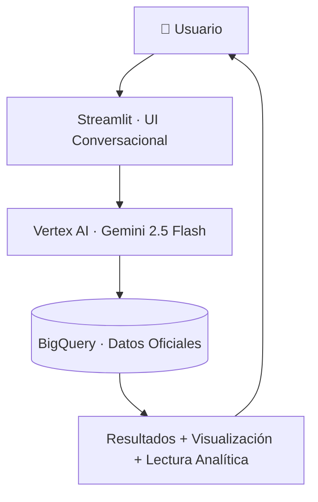
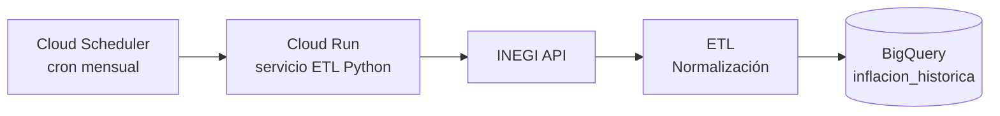

<div align="center">

# 📈 Inflación Copilot MX

**Plataforma conversacional para analizar poder adquisitivo en México**  
con lenguaje natural, datos oficiales e IA responsable.

[](https://github.com/tu-usuario/inflacion-copilot-mx)
[](https://python.org)
[](https://streamlit.io)
[](https://cloud.google.com)
[](https://docker.com)
[](LICENSE)
[](https://grow.google)

> No es un chatbot. Es un **copiloto analítico**.

</div>

---

## 🎯 ¿Qué es Inflación Copilot MX?

Inflación Copilot MX permite que cualquier persona consulte, calcule y entienda el impacto de la inflación en México de forma clara y confiable.

Convierte preguntas en lenguaje natural en cálculos económicos precisos, visualizaciones interactivas e interpretaciones basadas en datos oficiales del INEGI.

**Ejemplo de consulta:**

```
¿A cuánto equivalen $100 pesos de 2020 en 2024?
```

---

## 🚀 Funcionalidades

- Consultar inflación acumulada entre dos periodos
- Calcular equivalencias de poder adquisitivo históricas
- Visualizar la evolución del INPC
- Obtener interpretación económica automática
- Usar lenguaje natural como interfaz analítica

---

## 🧠 Diferenciadores clave

| Característica | Descripción |
|---|---|
| **Dominio acotado** | Solo inflación y poder adquisitivo en México |
| **IA con guardrails** | Valida intención semántica antes de responder |
| **Datos curados** | Fuente única: API oficial del INEGI |
| **Automatización total** | Pipeline ETL sin intervención manual |
| **Arquitectura empresarial** | Infraestructura cloud productiva en GCP |

---

## 🏛️ Fuente de Datos

**INEGI — API Oficial de Indicadores**

✔ Sin scraping · ✔ Sin intermediarios · ✔ Trazabilidad completa

---

## ☁️ Arquitectura del Sistema

### Flujo de consulta



### Pipeline ETL automatizado



---

## 🗄️ Modelo de Datos

**Dataset:** `datos_economicos_mx` · **Tabla:** `inflacion_historica`

| Campo | Tipo | Descripción |
|---|---|---|
| `fecha` | TIMESTAMP | Fecha del registro |
| `periodo` | STRING | Formato YYYY/MM |
| `valor_inpc` | FLOAT | Índice INPC |
| `tipo` | STRING | General / Subyacente / No subyacente |
| `procesado_en` | TIMESTAMP | Timestamp de carga |
| `fuente` | STRING | `API_INEGI` |

---

## 🤖 IA Responsable por Diseño

Antes de cualquier cálculo, el agente:

1. Interpreta la intención semántica de la consulta
2. Valida relevancia al dominio de inflación
3. Restringe fechas fuera del rango disponible
4. Rechaza solicitudes fuera de contexto
5. Usa únicamente fuentes oficiales verificables

| Tipo de consulta | Comportamiento |
|---|---|
| ✅ Válida | Calcula, visualiza y explica |
| ⚠️ Fuera de rango | Bloquea y notifica fechas válidas |
| 🚫 Fuera de dominio | Rechaza con mensaje claro |

---

## 🧩 Stack Tecnológico

| Capa | Tecnología |
|---|---|
| Frontend | Streamlit |
| IA Generativa | Google Vertex AI — Gemini 2.5 Flash |
| Base de Datos | Google BigQuery |
| Orquestación ETL | Cloud Scheduler + Cloud Run |
| Contenerización | Docker |
| Lenguaje | Python 3.12 |

---

## 📦 Instalación Local

```bash
git clone https://github.com/tu-usuario/inflacion-copilot-mx.git
cd inflacion-copilot-mx
pip install -r requirements.txt
streamlit run app.py
```

## 🐳 Despliegue con Docker

```bash
docker build -t inflacion-app .
docker run -p 8080:8080 inflacion-app
```

---

## 🧪 Casos de Uso

Educación financiera · Consultoría económica · Presentaciones ejecutivas · Herramientas fintech · Análisis macroeconómico

---

## 🤝 Contribuciones

Las contribuciones son bienvenidas. Por favor abre un *issue* para discutir cambios mayores antes de enviar un *pull request*.

---

## 📄 Licencia

Distribuido bajo licencia MIT.

---

<div align="center">

Desarrollado por **Edgar Trejo**  
como parte del programa **Google AI Essentials — AI Applied Challenge, Módulo 4**

*Implementa principios prácticos de IA Responsable: guardrails conversacionales, validación semántica de intención, restricción de dominio y trazabilidad de fuentes oficiales.*

</div>
