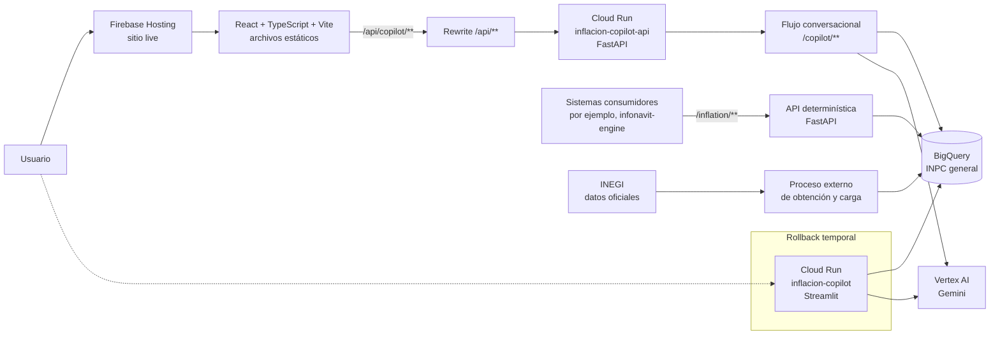

# Inflación Copilot MX

Aplicación educativa para analizar inflación y poder adquisitivo en México mediante lenguaje natural, cálculos reproducibles y datos oficiales del Índice Nacional de Precios al Consumidor (INPC).

**Estado actual:** React es el frontend productivo principal en Firebase Hosting y FastAPI es el backend productivo en Cloud Run. La API escala a cero cuando no recibe solicitudes. La aplicación Streamlit anterior permanece disponible temporalmente como rollback y su despliegue sólo puede iniciarse manualmente.

- Repositorio: [github.com/EdgarTrejoh/inflacion-copilot-mx](https://github.com/EdgarTrejoh/inflacion-copilot-mx)
- Aplicación productiva: [fluted-oath-477301-c1.web.app](https://fluted-oath-477301-c1.web.app)
- Tecnologías principales: React, TypeScript, Vite, FastAPI, Python, Firebase Hosting, Cloud Run, BigQuery, Vertex AI/Gemini y Docker.

> **Aviso:** La aplicación tiene fines educativos e informativos. No constituye asesoría financiera, fiscal, legal ni de inversión.

## Qué es el proyecto

Inflación Copilot MX ayuda a personas no técnicas, analistas y sistemas consumidores a entender cómo cambia el valor del dinero en México. La experiencia web acepta preguntas como “¿a cuánto equivale un monto entre dos periodos?”, consulta el INPC general almacenado en BigQuery y presenta:

- equivalencia monetaria;
- inflación acumulada;
- INPC inicial y final;
- histórico ordenado;
- gráfica y tabla;
- comentario analítico.

La solución separa dos responsabilidades:

1. **Interpretación generativa:** Gemini interpreta la pregunta, identifica monto y fechas, valida que pertenezca al dominio de inflación y genera un comentario explicativo.
2. **Cálculo determinístico:** las fórmulas económicas y los endpoints `/inflation/**` operan con parámetros estructurados y datos INPC. No invocan Gemini.

Los datos corresponden al INPC publicado por el INEGI. Este repositorio consume la tabla de BigQuery en modo lectura; el proceso externo que obtiene y carga los datos oficiales no forma parte del runtime del frontend ni de FastAPI.

## Arquitectura productiva


```mermaid
flowchart LR
    U["Usuario"] --> FH["Firebase Hosting<br/>sitio live"]
    FH --> FE["React + TypeScript + Vite<br/>archivos estáticos"]
    FE -->|"/api/copilot/**"| RW["Rewrite /api/**"]
    RW --> API["Cloud Run<br/>inflacion-copilot-api<br/>FastAPI"]

    API --> CONV["Flujo conversacional<br/>/copilot/**"]
    CONV --> BQ[("BigQuery<br/>INPC general")]
    CONV --> VA["Vertex AI<br/>Gemini"]

    SYS["Sistemas consumidores<br/>por ejemplo, infonavit-engine"] -->|"/inflation/**"| DET["API determinística<br/>FastAPI"]
    DET --> BQ

    INEGI["INEGI<br/>datos oficiales"] --> LOAD["Proceso externo<br/>de obtención y carga"]
    LOAD --> BQ

    subgraph RB["Rollback temporal"]
        ST["Cloud Run<br/>inflacion-copilot<br/>Streamlit"]
    end
    U -.-> ST
    ST --> BQ
    ST --> VA
```

### Flujos diferenciados

- **Conversacional:** navegador → Firebase Hosting → `/api/copilot/**` → FastAPI → BigQuery y Vertex AI.
- **Determinístico:** sistemas → `/inflation/**` → FastAPI → BigQuery. No usa Gemini.
- **Datos:** INEGI → proceso externo de carga → BigQuery → servicios de consulta.
- **Rollback:** Streamlit continúa en un servicio Cloud Run independiente y no recibe tráfico desde Firebase Hosting.

Firebase sirve la SPA y reescribe `/api/**` al servicio productivo `inflacion-copilot-api` en `us-central1`. FastAPI registra los endpoints conversacionales tanto en `/copilot/**` como en `/api/copilot/**`. Los endpoints determinísticos no tienen alias `/api`.

Una pestaña React abierta no utiliza WebSocket, EventSource ni polling periódico. Después de completar la carga inicial o una consulta iniciada por la persona usuaria, no mantiene solicitudes abiertas al backend.

## Stack

| Capa | Tecnología | Responsabilidad |
|---|---|---|
| Frontend productivo | React 19, TypeScript, Vite | Interfaz, estados y consumo HTTP |
| Visualización | SVG nativo | Gráfica responsiva del histórico INPC |
| Backend | FastAPI, Python | Contratos conversacionales y determinísticos |
| IA generativa | Vertex AI / Gemini | Interpretación de lenguaje natural y comentario |
| Datos | BigQuery | Consulta de INPC general |
| Hosting | Firebase Hosting | Archivos estáticos, SPA y rewrite `/api/**` |
| Cómputo | Cloud Run | Contenedor FastAPI con escalado a cero |
| Contenedores | Docker | Imagen API mediante `Dockerfile.api` |
| Rollback temporal | Streamlit | Experiencia anterior, desplegable manualmente |

## Funcionalidades

- Preguntas en lenguaje natural sobre inflación y poder adquisitivo en México.
- Monto predeterminado cuando la consulta omite una cantidad.
- Validación de dominio, formato, orden y rango dinámico de fechas.
- Equivalencia monetaria, factor de actualización e inflación acumulada.
- Histórico INPC ordenado, gráfica SVG y tabla accesible.
- Comentario analítico generado con Gemini, con degradación controlada si falla.
- Mensajes comprensibles para preguntas vacías, rechazos, datos ausentes y errores HTTP o de red.
- Diseño responsivo y navegación semántica para usuarios no técnicos.
- Endpoints determinísticos para integración estructurada.

## Desarrollo local

### Requisitos

- Python compatible con el entorno virtual del proyecto.
- Node.js y npm compatibles con `frontend/package-lock.json`.
- Credenciales de aplicación de Google sólo si se consultarán servicios reales. Las pruebas automatizadas usan mocks o fakes.

### Backend

Desde la raíz:

```powershell
.\.venv\Scripts\python.exe -m uvicorn api.main:app --reload --port 8020
```

FastAPI queda disponible en `http://127.0.0.1:8020`. Para usar BigQuery y Vertex AI se requieren:

```text
GCP_PROJECT_ID
GCP_LOCATION
GCP_TABLE_ID
COPILOT_ALLOWED_ORIGINS
```

`PORT` lo inyecta Cloud Run; localmente Uvicorn recibe el puerto por línea de comandos.

### Frontend

Consulta también la [guía específica del frontend](frontend/README.md) para conocer componentes, contratos consumidos y manejo de errores.

```powershell
cd frontend
Copy-Item .env.example .env.local
npm ci
npm run dev
```

`frontend/.env.example` define:

```env
VITE_API_BASE_URL=http://127.0.0.1:8020
```

Vite muestra la URL local al iniciar; normalmente es `http://localhost:5173`.

### Build productivo local

```powershell
cd frontend
$env:VITE_API_BASE_URL="http://127.0.0.1:8020"
npm run build
npx vite preview --host 127.0.0.1 --port 5173
```

Actualmente `frontend/package.json` **no contiene** un script `preview`; debe utilizarse `npx vite preview` salvo que el repositorio cambie posteriormente.

## API conversacional

La interfaz React consume estos contratos. En acceso directo al backend se encuentran bajo `/copilot/**`; en producción Firebase los expone como `/api/copilot/**`.

### `POST /copilot/query`

Alias productivo: `POST /api/copilot/query`.

Cuerpo:

```json
{
  "question": "Pregunta sobre inflación y poder adquisitivo"
}
```

La respuesta exitosa contiene los campos reales:

- `question`;
- `intent`: validez, rechazo, fechas y monto interpretados;
- `result`: estado, mensaje y detalle del cálculo;
- `history`: lista de objetos `date` e `inpc`;
- `formatted_result`;
- `analytical_comment`.

Devuelve errores controlados `400`, `404` o `502` según validación, ausencia de datos o dependencia externa.

### `GET /copilot/history`

Alias productivo: `GET /api/copilot/history`.

Parámetros obligatorios:

- `start_date=YYYY-MM-DD`;
- `end_date=YYYY-MM-DD`.

Devuelve `start_date`, `end_date`, `indicator`, `source` e `history`.

### `GET /copilot/date-range`

Alias productivo: `GET /api/copilot/date-range`.

Devuelve `min_date`, `max_date`, `indicator` y `source`. La fecha máxima se consulta dinámicamente desde los datos disponibles.

## API determinística

Estos endpoints están pensados para consumo estructurado por integraciones como `infonavit-engine`. No usan Gemini, prompts ni estado de Streamlit.

| Método y ruta | Parámetros | Uso |
|---|---|---|
| `GET /health` | Ninguno | Salud del servicio |
| `GET /inflation/period` | `start_date`, `end_date` | Inflación punto a punto |
| `GET /inflation/average-period` | `current_year`, `previous_year`, `month_limit` | Promedios comparables anual/YTD |
| `GET /inflation/monthly-comparable` | `current_year`, `previous_year`, `month_limit` | Factores mensuales comparables |

Las fechas usan `YYYY-MM-DD`; `month_limit` acepta valores de 1 a 12. Las respuestas incluyen fuente, indicador, método y valores calculados. Los meses sin pares comparables se reportan en `warnings`; si no existe ningún par, el endpoint responde `404`.

La fórmula punto a punto es:

```text
factor = inpc_end / inpc_start
inflation_pct = (factor - 1) * 100
```

La documentación OpenAPI local se encuentra en `http://127.0.0.1:8020/docs`.

## Pruebas

Desde la raíz:

```powershell
.\.venv\Scripts\python.exe -m pytest -q
```

Frontend:

```powershell
cd frontend
npm test
npm run test:integration
npm run build
```

Las pruebas de integración realizan HTTP real contra una aplicación FastAPI temporal, pero sustituyen BigQuery y Vertex AI; no llaman servicios reales de GCP.

## Despliegue y operación

- `firebase.production.json`: sitio Firebase live; publica `frontend/dist` y reescribe `/api/**` a `inflacion-copilot-api`.
- `firebase.beta.json`: canal beta separado; apunta a `inflacion-copilot-api-beta`.
- `Dockerfile.api`: inicia exclusivamente `api.main:app` con Uvicorn y respeta `PORT`.
- `Dockerfile`: conserva la aplicación Streamlit de rollback.
- `.github/workflows/deploy.yml`: despliegue manual de Streamlit mediante `workflow_dispatch`; no se ejecuta con pushes o merges.

Las imágenes productivas deben identificarse con el SHA completo del commit o con otro tag inmutable. No se recomienda desplegar tags mutables.

Las instrucciones operativas, validaciones y rollback están en [deployment/PRODUCTION_OPERATIONS.md](deployment/PRODUCTION_OPERATIONS.md). La historia de la beta está en [deployment/BETA_DEPLOYMENT_HISTORY.md](deployment/BETA_DEPLOYMENT_HISTORY.md).

## Estado y limitaciones

- Streamlit sigue siendo una dependencia transitoria de la imagen API porque `inflacion_service.py` conserva decoradores de caché; `Dockerfile.api` no inicia el servidor Streamlit.
- La API pública no incorpora todavía autenticación ni rate limiting.
- Los tipos TypeScript se verifican en compilación y pruebas, pero las respuestas no se validan en runtime mediante un esquema.
- Las fuentes Google usadas por la interfaz requieren acceso externo; si se bloquean, el navegador utiliza las fuentes alternativas definidas en CSS.
- El pipeline que obtiene datos del INEGI no se implementa en este repositorio.
- Streamlit debe retirarse sólo después del periodo de convivencia y de una decisión explícita con rollback probado.
- El proyecto es educativo y analítico; no reemplaza el criterio de un profesional.

## Contribuciones

Antes de proponer cambios amplios, abre un issue. Todo pull request debe mantener la separación entre el flujo conversacional, la API determinística y el rollback Streamlit, además de ejecutar la matriz de pruebas correspondiente.

## Licencia

Consulta las condiciones de licencia disponibles en el repositorio.
